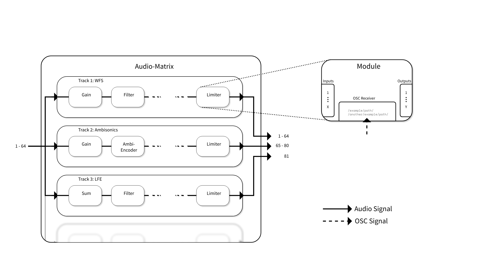

# Audio-Matrix

The Audio Matrix is a configurable router and signal processor for Audio-Setups with lots of channels/speakers that offers built in remote control via OSC.

It runs as a JACK client.

A configurable amount of input tracks is routed in parallel through user configurable tracks, that can process the audio on them using a variety of modules.

An example Procesing setup could look like this:

# Licenses

This Project is licensed under the GPLv3.

Calculation of the IIR filter coefficients is performed using the IIR library by [Exstrom Laboratories](https://www.exstrom.com/journal/sigproc/dsigproc.html), also licensed under the GPLv3

AudioBuffer and RingBuffer implementations are taken from the [anira](https://github.com/tu-studio/anira) library, licensed under Apache License 2.0
